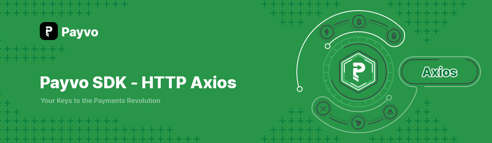

# Payvo SDK - HTTP Axios

<p align="center">
    
</p>

> Lead Maintainer: [Brian Faust](https://github.com/faustbrian)

## Installation

```bash
npm install @payvo/sdk-http-axios
```

## Usage

Documentation can be found [here](https://ark.dev/docs/payvo-sdk/http/axios).

## Security

If you discover a security vulnerability within this package, please send an e-mail to security@payvo.com. All security vulnerabilities will be promptly addressed.

## Credits

This project exists thanks to all the people who [contribute](../../contributors).

## License

[MIT](LICENSE) © [Payvo](https://payvo.com)
